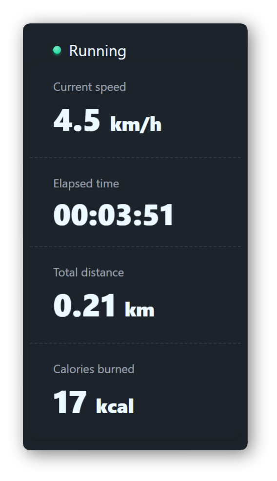

# Treadmill Monitor

A cross-platform desktop application to monitor and log data from FTMS-enabled treadmills over Bluetooth Low Energy (BLE).

## Features

- Auto-discovery of FTMS devices
- Support for accumulating metrics after treadmill resets
- Real-time display of treadmill metrics
- [DaisyUI](https://daisyui.com/)-based user interface
- CSV logging of treadmill data

## Usage

The recommended way to run the application is via the `uvx` command shipped with [uv](https://docs.astral.sh/uv/):

```bash
uvx --python 3.13 https://github.com/PJBarczyk/treadmill-monitor.git
```

*Python 3.13 is recommended due to 3.14 not being fully supported by some dependencies at the time of writing.*

Behavior can be customized via command-line flags:

- `--address ADDRESS`: Connect to a treadmill with the specified Bluetooth address. If not provided, the application will attempt to auto-discover FTMS devices.
- `--log-file PATH`: Path to a CSV file where treadmill data will be logged. If not provided, logging is disabled.
- `--resumable`: Enable resumable mode that accumulates certain metrics (e.g. `total_distance`, `total_energy`, `time_elapsed`) across sessions until the application is closed.

## Limitations

- Only one BLE client can connect to a treadmill at a time. Ensure no other applications (e.g. smartphone apps) are connected to the treadmill while using this application.
- **Fitness Machine Control Point** characteristic is not supported; the application is read-only.

## License

This project is licensed under the MIT License. See the [LICENSE](LICENSE) file for details.